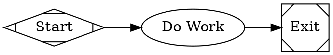
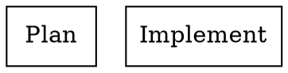
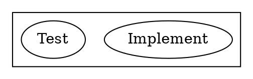

# DOT DSL Reference

Mammoth pipelines are defined using Graphviz DOT digraph syntax with custom attributes for controlling LLM agent execution, conditional branching, human interaction, and more.

## Graph Structure

Every pipeline is a `digraph` containing nodes (stages) and directed edges (transitions).



## Graph Attributes

Graph-level attributes are set in the `graph [...]` block and configure pipeline-wide behavior.

| Attribute | Type | Description |
|-----------|------|-------------|
| `goal` | string | The pipeline's objective. Available as `$goal` in node prompts via variable expansion. |
| `model_stylesheet` | string | CSS-like stylesheet assigning LLM models/providers to nodes. See [Stylesheet Syntax](#stylesheet-syntax). |
| `default_fidelity` | string | Default context fidelity mode for all transitions. One of: `full`, `truncate`, `compact`, `summary:low`, `summary:medium`, `summary:high`. Defaults to `compact`. |
| `default_max_retry` | int | Default maximum retry count for all nodes. |
| `retry_target` | string | Node ID to retry from when a goal gate fails. |
| `fallback_retry_target` | string | Fallback retry target when the primary is not set. |
| `stack.child_dotfile` | string | Path to a child DOT file for manager loop nodes. |

Example with multiple attributes:

```dot
digraph example {
    graph [
        goal="Create a REST API",
        retry_target="implement",
        default_max_retry=2,
        default_fidelity="compact",
        model_stylesheet="
            * { llm_model: claude-sonnet-4-5; llm_provider: anthropic; }
            .code { llm_model: claude-opus-4-6; }
        "
    ]
}
```

## Node Shapes and Handler Types

Each node shape maps to a handler that determines how the node is executed. You can also override the handler by setting the `type` attribute explicitly.

| Shape | Handler Type | Description |
|-------|-------------|-------------|
| `Mdiamond` | `start` | Pipeline entry point. Exactly one required. Records start timestamp. |
| `Msquare` | `exit` | Pipeline terminal node. At least one required. Records finish timestamp. |
| `box` | `codergen` | LLM coding agent node (default for unknown shapes). Sends prompt to an LLM. |
| `diamond` | `conditional` | Conditional routing node. Edges carry `condition` attributes for branching. |
| `hexagon` | `wait.human` | Human gate. Presents choices from outgoing edge labels to a human. |
| `component` | `parallel` | Parallel fan-out. Spawns concurrent branches from outgoing edges. |
| `tripleoctagon` | `parallel.fan_in` | Parallel fan-in. Waits for branches to complete and merges results. |
| `parallelogram` | `tool` | External tool/command executor. Runs a shell command. |
| `house` | `stack.manager_loop` | Manager supervision loop. Observe/guard/steer cycle over a child pipeline. |

### Explicit Type Override

You can override the shape-based handler resolution by setting the `type` attribute directly:

```dot
my_node [shape=box, type="wait.human", label="Custom Human Gate"]
```

The resolution order is:
1. Explicit `type` attribute on the node
2. Shape-based mapping (table above)
3. Default to `codergen`

## Node Attributes

### Common Attributes (All Nodes)

| Attribute | Type | Description |
|-----------|------|-------------|
| `shape` | string | Graphviz shape determining handler type. |
| `label` | string | Display label. Also used as fallback prompt for codergen nodes. |
| `type` | string | Explicit handler type override. |
| `fidelity` | string | Context fidelity mode for this node. Overrides graph default. |
| `goal_gate` | bool | When `true`, this node must succeed for the pipeline to complete. |
| `retry_target` | string | Node ID to retry from if this node's goal gate fails. |
| `fallback_retry_target` | string | Fallback retry target for this node. |
| `max_retries` | int | Maximum number of retry attempts for this node. |
| `allow_partial` | bool | When `true`, exhausted retries produce `partial_success` instead of `fail`. |
| `class` | string | Comma-separated class names for stylesheet matching. |

### Codergen Node Attributes (shape=box)

| Attribute | Type | Description |
|-----------|------|-------------|
| `prompt` | string | Instructions sent to the LLM. Supports `$variable` expansion. |
| `llm_model` | string | Model ID (e.g., `claude-opus-4-6`, `gpt-5.2`). |
| `llm_provider` | string | Provider name (`anthropic`, `openai`, `gemini`). |
| `max_turns` | int | Maximum agent loop turns. Default: 20. |
| `workdir` | string | Working directory for the agent's file operations. |

### Tool Node Attributes (shape=parallelogram)

| Attribute | Type | Description |
|-----------|------|-------------|
| `command` | string | Shell command to execute (preferred over `prompt`). |
| `prompt` | string | Fallback if `command` is not set. |
| `timeout` | duration | Execution timeout (e.g., `30s`, `5m`). Default: 30s. |
| `working_dir` | string | Working directory for command execution. |
| `env_*` | string | Environment variables. The `env_` prefix is stripped (e.g., `env_PATH="/usr/bin"`). |

### Human Gate Attributes (shape=hexagon)

| Attribute | Type | Description |
|-----------|------|-------------|
| `label` | string | Question text shown to the human. Default: "Select an option:" |
| `timeout` | duration | Time limit for human response (e.g., `5m`, `1h`). |
| `default_choice` | string | Edge label to auto-select if timeout expires. |
| `reminder_interval` | duration | Interval for re-prompting (if interviewer supports it). |

### Parallel Node Attributes (shape=component)

| Attribute | Type | Description |
|-----------|------|-------------|
| `join_policy` | string | How to merge branches: `wait_all`, `wait_any`, `k_of_n`, `quorum`. Default: `wait_all`. |
| `error_policy` | string | Branch failure handling: `continue` or `fail_fast`. Default: `continue`. |
| `max_parallel` | int | Maximum concurrent branches. Default: 4. |

### Manager Loop Attributes (shape=house)

| Attribute | Type | Description |
|-----------|------|-------------|
| `observe_prompt` | string | Prompt for the observe step. |
| `guard_condition` | string | Condition evaluated during the guard step. |
| `steer_prompt` | string | Prompt for the steer correction step. |
| `max_iterations` | int | Maximum observe/guard/steer cycles. Default: 10. |
| `sub_pipeline` | string | Identifier for the sub-pipeline being supervised. |

## Edge Attributes

Edges represent transitions between nodes. They carry attributes that control routing, conditions, and fidelity.

| Attribute | Type | Description |
|-----------|------|-------------|
| `label` | string | Display label. Used for human gate choices and preferred label matching. |
| `condition` | string | Condition expression controlling when this edge is taken. See [Condition Expressions](#condition-expressions). |
| `fidelity` | string | Context fidelity for this transition. Overrides node and graph defaults. |
| `weight` | int | Priority weight for edge selection tiebreaking. Higher wins. |
| `loop_restart` | bool | When `true`, taking this edge restarts the pipeline from the target node with a fresh context. |
| `goal_gate` | bool | When `true` on an edge's target, the target node's success is required for pipeline completion. |

### Edge Selection Algorithm

When a node completes, the engine selects the next edge using this five-step priority:

1. **Condition match**: Edges with a non-empty `condition` that evaluates to true. Ties broken by weight, then lexical order of target node ID.
2. **Preferred label**: If the outcome has a `PreferredLabel`, match it against edge labels (normalized, case-insensitive).
3. **Suggested next IDs**: If the outcome suggests specific target node IDs.
4. **Highest weight**: Among unconditional edges (no `condition` or empty condition).
5. **Lexical tiebreak**: By target node ID alphabetical order.

## Condition Expressions

Conditions are boolean expressions on edges that control routing. They use a simple clause-based grammar.

### Grammar

```
Expression := Clause ('&&' Clause)*
Clause     := Key Operator Literal
Key        := 'outcome' | 'preferred_label' | 'context.' Path | bare_identifier
Operator   := '=' | '!='
```

### Key Resolution

| Key | Resolves To |
|-----|------------|
| `outcome` | The status of the previous node: `success`, `fail`, `partial_success`, `retry`, `skipped`. |
| `preferred_label` | The `PreferredLabel` field of the previous node's outcome. |
| `context.X` | Value of key `X` in the pipeline context (tries full key first, then suffix). |
| `bare_key` | Value of `bare_key` in the pipeline context. |

### Examples

```dot
// Simple outcome check
edge1 -> edge2 [condition="outcome = success"]

// Negation
edge1 -> edge3 [condition="outcome != success"]

// Multiple clauses (AND)
edge1 -> edge2 [condition="outcome = success && context.mode = production"]

// Context variable
gate -> deploy [condition="context.env = staging"]
```

## Variable Expansion

Node attributes support `$variable` expansion using graph-level attributes as the source. Variables are expanded during the transform phase before validation.

```dot
digraph example {
    graph [goal="Build a REST API", language="Go"]

    plan [prompt="Plan the implementation for: $goal in $language"]
    // After expansion: "Plan the implementation for: Build a REST API in Go"
}
```



Only graph-level attribute keys are available for expansion. Unknown `$variables` are left as-is.

## Fidelity Modes

Fidelity controls how much context is carried between pipeline stages. This manages token budgets across long pipelines.

| Mode | Description |
|------|-------------|
| `full` | Complete context carried forward (no reduction). |
| `truncate` | Context is truncated to fit token limits. |
| `compact` | Context is compacted, removing redundant information. **Default.** |
| `summary:low` | Minimal summary of previous context. |
| `summary:medium` | Moderate summary of previous context. |
| `summary:high` | Detailed summary of previous context. |

### Fidelity Precedence

Fidelity is resolved with this precedence (highest first):
1. Edge `fidelity` attribute
2. Target node `fidelity` attribute
3. Graph `default_fidelity` attribute
4. Hardcoded default: `compact`

```dot
// Edge-level override
plan -> implement [fidelity="full"]

// Node-level default
implement [fidelity="summary:high", prompt="..."]

// Graph-level default
graph [default_fidelity="compact"]
```

## Stylesheet Syntax

The `model_stylesheet` graph attribute uses a CSS-like syntax to assign LLM properties to nodes based on selectors.

### Selectors

| Selector | Specificity | Description |
|----------|------------|-------------|
| `*` | 0 | Universal selector. Matches all nodes. |
| `.classname` | 1 | Class selector. Matches nodes with the given class (set via `class` attribute). |
| `#nodeid` | 2 | ID selector. Matches a single node by its ID. |

Higher specificity overrides lower. Explicit node attributes always override stylesheet properties.

### Syntax

```css
selector {
    property: value;
    property2: value2;
}
```

### Properties

Any key-value pair can be set. Common properties:

| Property | Description |
|----------|-------------|
| `llm_model` | Model ID to use (e.g., `claude-opus-4-6`). |
| `llm_provider` | Provider name (e.g., `anthropic`). |
| `reasoning_effort` | Reasoning effort level (e.g., `high`). |

### Example

```dot
graph [
    model_stylesheet="
        * { llm_model: claude-sonnet-4-5; llm_provider: anthropic; }
        .code { llm_model: claude-opus-4-6; }
        #critical_review { llm_model: gpt-5.2; llm_provider: openai; reasoning_effort: high; }
    "
]

plan      [class="planning", prompt="..."]
implement [class="code", prompt="..."]
critical_review [class="code", prompt="..."]
```

In this example:
- `plan` gets `claude-sonnet-4-5` from the `*` rule (class `planning` has no rule).
- `implement` gets `claude-opus-4-6` from the `.code` rule (specificity 1 overrides `*`).
- `critical_review` gets `gpt-5.2` from the `#critical_review` rule (specificity 2 overrides `.code`).

Nodes support comma-separated classes: `class="code,frontend"` matches both `.code` and `.frontend` selectors.

## Node Defaults

You can set default attributes for all nodes or edges using the `node` and `edge` statements:



## Subgraphs

Subgraphs provide scoped node defaults:



## Accelerator Keys in Edge Labels

Human gate edges support keyboard accelerator prefixes for quick selection. These are stripped during label normalization:

```dot
review_gate -> approve [label="[A] Approve"]
review_gate -> fix     [label="[F] Fix Issues"]
review_gate -> reject  [label="R) Reject"]
review_gate -> defer   [label="D - Defer"]
```

Supported formats: `[K] Label`, `K) Label`, `K - Label`. The accelerator key is the single character before the delimiter.

## Pipeline Validation

Mammoth validates pipelines before execution. The built-in rules are:

| Rule | Severity | Description |
|------|----------|-------------|
| `start_node` | ERROR | Exactly one start node (shape=Mdiamond) must exist. |
| `terminal_node` | ERROR | At least one exit node (shape=Msquare) must exist. |
| `reachability` | ERROR | All nodes must be reachable from the start node. |
| `edge_target_exists` | ERROR | All edge endpoints must reference existing nodes. |
| `start_no_incoming` | ERROR | Start node must have no incoming edges. |
| `exit_no_outgoing` | ERROR | Exit nodes must have no outgoing edges. |
| `condition_syntax` | ERROR | Edge condition expressions must be syntactically valid. |
| `type_known` | WARNING | Node `type` values should be recognized handler types. |
| `fidelity_valid` | WARNING | Fidelity mode values should be valid. |
| `retry_target_exists` | WARNING | `retry_target` should reference an existing node. |
| `goal_gate_has_retry` | WARNING | Nodes with `goal_gate=true` should have a `retry_target`. |
| `prompt_on_llm_nodes` | WARNING | Codergen nodes should have a `prompt` or `label` attribute. |

See also: [CLI Usage](cli-usage.md) for running validation, [Handlers Reference](handlers.md) for handler details, [Backend Configuration](backend-config.md) for LLM setup.
