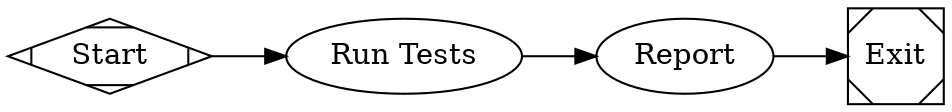
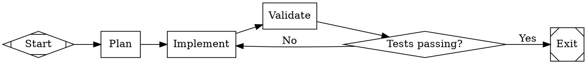
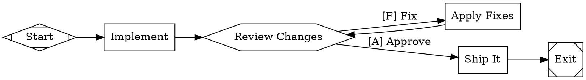

# End-to-End Walkthrough

This guide walks through writing, validating, and running mammoth pipelines from scratch. By the end, you'll understand the full workflow: writing DOT pipelines, configuring models, running them, interpreting output, and using advanced features like human gates and stylesheets.

## Prerequisites

1. Build mammoth:
   ```bash
   go build -o mammoth ./cmd/mammoth/
   ```

2. Set at least one API key:
   ```bash
   export ANTHROPIC_API_KEY="sk-ant-..."
   ```

## Writing Your First Pipeline

Create a file called `my_first.dot`:



This defines a linear pipeline with four nodes:
- **start** (Mdiamond): Entry point.
- **run_tests** (box, implicit): An LLM agent node that runs tests.
- **report** (box, implicit): An LLM agent node that summarizes results.
- **exit** (Msquare): Terminal node.

Nodes without an explicit `shape` default to `box` (codergen handler).

### Validate It

Always validate before running:

```bash
./mammoth -validate my_first.dot
```

Expected output:

```
Pipeline is valid.
```

If there are issues, you'll see diagnostics:

```
[ERROR] graph has no start node (shape=Mdiamond) -- fix: add a node with shape=Mdiamond
Validation failed.
```

### Run It

```bash
./mammoth -verbose my_first.dot
```

The `-verbose` flag shows stage transitions:

```
[pipeline] started
[stage] start started
[stage] start completed
[stage] run_tests started
[stage] run_tests completed
[stage] report started
[stage] report completed
[stage] exit started
[stage] exit completed
[pipeline] completed
Pipeline completed successfully.
Completed nodes: [start run_tests report exit]
Final status: success
```

## Understanding the Output

When a pipeline completes, mammoth prints:

- **Completed nodes**: The ordered list of nodes that executed successfully.
- **Final status**: The outcome of the last node (`success`, `fail`, `partial_success`).

With `-verbose`, you also see real-time lifecycle events on stderr:
- `[stage] X started` / `[stage] X completed` -- node execution lifecycle.
- `[stage] X retrying` -- a node is being retried after failure.
- `[checkpoint] saved at X` -- a checkpoint was written (requires `-checkpoint-dir`).
- `[pipeline] started` / `[pipeline] completed` / `[pipeline] failed` -- pipeline lifecycle.

## Adding Conditional Branching

Create `branching.dot`:



Key concepts:
- **`$goal`**: Variable expansion. Replaced with the graph's `goal` attribute.
- **`shape=diamond`**: Conditional routing node. The handler itself is a no-op; routing happens via edge conditions.
- **`condition="outcome = success"`**: Edge conditions evaluated against the previous node's outcome.
- **Loop back**: The "No" edge loops back to `implement`, creating a retry loop.

Run and validate:

```bash
./mammoth -validate branching.dot
./mammoth -verbose branching.dot
```

## Adding Human Gates

Create `human_review.dot`:



Key concepts:
- **`shape=hexagon`**: Human gate node.
- **Edge labels as choices**: `[A] Approve` and `[F] Fix` become options presented to the human. The `[A]` and `[F]` are accelerator keys for quick selection.
- **Loop back through human**: After fixes, the pipeline returns to the review gate.

### Running with Human Interaction

In CLI mode, the `ConsoleInterviewer` reads from stdin:

```bash
./mammoth human_review.dot
```

Output:

```
[?] Review Changes
  - [A] Approve
  - [F] Fix
Select: A
```

### Human Interaction via HTTP Server

In server mode, human gates produce pending questions at the REST API:

```bash
# Start server
./mammoth -server -port 2389

# Submit pipeline
curl -X POST http://localhost:2389/pipelines -d @human_review.dot

# Check for pending questions
curl http://localhost:2389/pipelines/{id}/questions

# Answer a question
curl -X POST http://localhost:2389/pipelines/{id}/questions/{qid}/answer \
  -H "Content-Type: application/json" \
  -d '{"answer": "[A] Approve"}'
```

### Timeout and Default Choice

Add a timeout with a default choice:

```dot
review_gate [
    shape=hexagon,
    label="Review Changes",
    timeout="30m",
    default_choice="[A] Approve"
]
```

If no human responds within 30 minutes, the pipeline auto-selects "Approve".

## Using Stylesheets

For pipelines with multiple LLM nodes, a model stylesheet assigns models efficiently. Create `styled_pipeline.dot`:

```dot
digraph styled_pipeline {
    graph [
        goal="Create a hello world Python script",
        retry_target="implement",
        default_max_retry=2,
        model_stylesheet="
            * { llm_model: claude-sonnet-4-5; llm_provider: anthropic; }
            .code { llm_model: claude-opus-4-6; llm_provider: anthropic; }
            #critical_review { llm_model: gpt-5.2; llm_provider: openai; reasoning_effort: high; }
        "
    ]
    rankdir=LR

    start [shape=Mdiamond, label="Start"]
    done  [shape=Msquare, label="Done"]

    plan [
        label="Plan",
        class="planning",
        prompt="Plan how to create a hello world script for: $goal"
    ]

    implement [
        label="Implement",
        class="code",
        prompt="Write the code based on the plan",
        goal_gate=true,
        max_retries=3
    ]

    validate [
        label="Run Tests",
        class="code",
        prompt="Run the test suite and check for correctness"
    ]

    tests_ok [shape=diamond, label="Tests passing?"]

    critical_review [
        label="Critical Review",
        class="code",
        prompt="Deep review of the implementation"
    ]

    human_review [
        shape=hexagon,
        label="Human Approval",
        type="wait.human"
    ]

    ship [label="Ship", prompt="Prepare the final release artifacts"]

    start -> plan -> implement -> validate -> tests_ok
    tests_ok -> critical_review [label="Pass", condition="outcome = success"]
    tests_ok -> implement       [label="Fail", condition="outcome = fail"]
    critical_review -> human_review
    human_review -> ship       [label="[A] Approve"]
    human_review -> implement  [label="[R] Revise"]
    ship -> done
}
```



How the stylesheet resolves:

| Node | Class | Matched Rule | Model |
|------|-------|-------------|-------|
| `plan` | `planning` | `*` (no `.planning` rule) | `claude-sonnet-4-5` |
| `implement` | `code` | `.code` (specificity 1) | `claude-opus-4-6` |
| `validate` | `code` | `.code` (specificity 1) | `claude-opus-4-6` |
| `critical_review` | `code` | `#critical_review` (specificity 2) | `gpt-5.2` |
| `ship` | (none) | `*` (specificity 0) | `claude-sonnet-4-5` |

## Goal Gates and Retry

Goal gates ensure critical nodes succeed before the pipeline can complete:

```dot
implement [
    label="Implement",
    prompt="Write the code",
    goal_gate=true,
    max_retries=3
]
```

When the exit node is reached, the engine checks all nodes with `goal_gate=true`. If any have a non-success outcome, the engine retries from the configured `retry_target`:

```dot
graph [retry_target="implement"]
```

The retry target can also be set per-node:

```dot
implement [goal_gate=true, retry_target="plan"]
```

## Working with the Example Pipelines

Mammoth ships with several example pipelines in the `examples/` directory:

### examples/simple.dot

Minimal linear pipeline: start -> run tests -> report -> exit.

```bash
./mammoth -verbose examples/simple.dot
```

### examples/branching.dot

Conditional branching with a retry loop: plan -> implement -> validate -> gate -> (exit or retry).

```bash
./mammoth -verbose examples/branching.dot
```

### examples/human_gate.dot

Human-in-the-loop code review with approve/fix cycle.

```bash
./mammoth examples/human_gate.dot
```

### examples/goal_gate.dot

Goal gate enforcement: implement must succeed before pipeline completion.

```bash
./mammoth -verbose -retry standard examples/goal_gate.dot
```

### examples/full_pipeline.dot

Full-featured pipeline exercising stylesheets, goal gates, conditional branching, and human review.

```bash
./mammoth -verbose examples/full_pipeline.dot
```

### examples/plan_implement_review.dot

Plan-implement-review cycle with goal gates and conditional routing.

```bash
./mammoth -verbose examples/plan_implement_review.dot
```

### examples/build_pong.dot

Builds a complete Pong TUI game. Multi-phase: plan, scaffold, implement, compile, review, polish.

```bash
./mammoth -verbose -retry standard -checkpoint-dir ./checkpoints examples/build_pong.dot
```

### examples/build_htmx_blog.dot

Builds an HTMX blog platform with Flask. Multi-phase with frontend and backend tracks.

```bash
./mammoth -verbose -retry standard examples/build_htmx_blog.dot
```

## Checkpointing for Long Pipelines

For pipelines that take a long time, enable checkpointing to recover from crashes:

```bash
./mammoth -checkpoint-dir ./checkpoints -verbose examples/build_pong.dot
```

Checkpoints are saved after each node completes. If the process crashes, you can examine the checkpoint files:

```bash
ls ./checkpoints/
# checkpoint_plan_1707307200000000000.json
# checkpoint_implement_1707307260000000000.json
```

The engine supports resuming from a checkpoint programmatically via `Engine.ResumeFromCheckpoint()`.

## Putting It All Together

Here's a complete workflow for a real project:

```bash
# 1. Set up API keys
export ANTHROPIC_API_KEY="sk-ant-..."
export OPENAI_API_KEY="sk-..."

# 2. Write your pipeline (see examples above)
vim my_pipeline.dot

# 3. Validate
./mammoth -validate my_pipeline.dot

# 4. Run with verbose output and checkpointing
./mammoth -verbose \
  -retry standard \
  -checkpoint-dir ./checkpoints \
  -artifact-dir ./artifacts \
  my_pipeline.dot

# 5. Or run via HTTP server for web-based human interaction
./mammoth -server -port 2389 -verbose -retry standard
```

## Next Steps

- [DSL Reference](dsl-reference.md) -- Complete attribute and syntax reference.
- [Handlers Reference](handlers.md) -- Detailed documentation for each handler type.
- [CLI Usage](cli-usage.md) -- All flags, server endpoints, and exit codes.
- [Backend Configuration](backend-config.md) -- Provider setup, model catalog, and retry policies.
